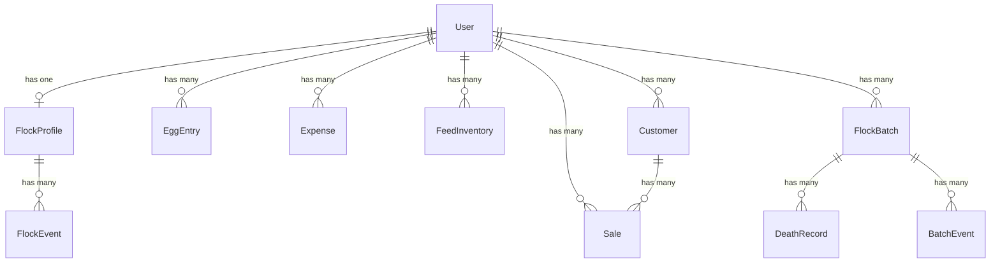
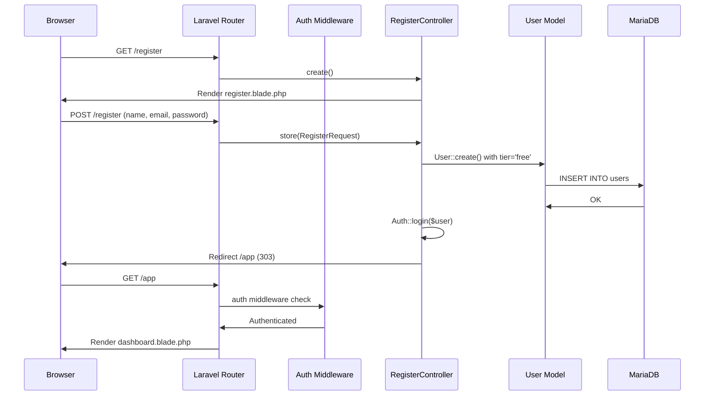
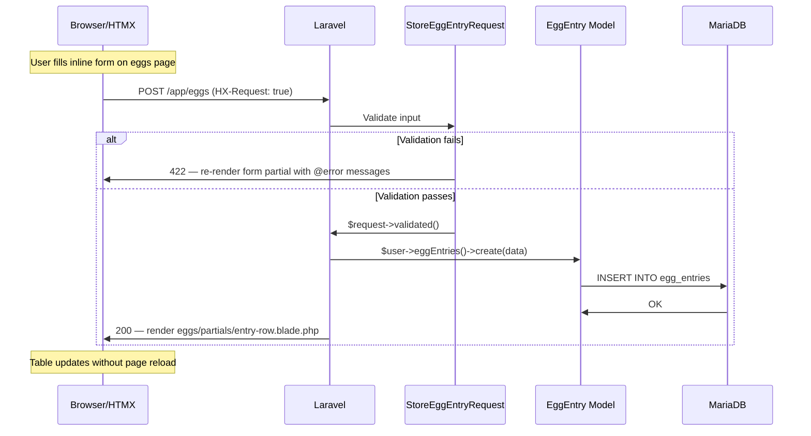
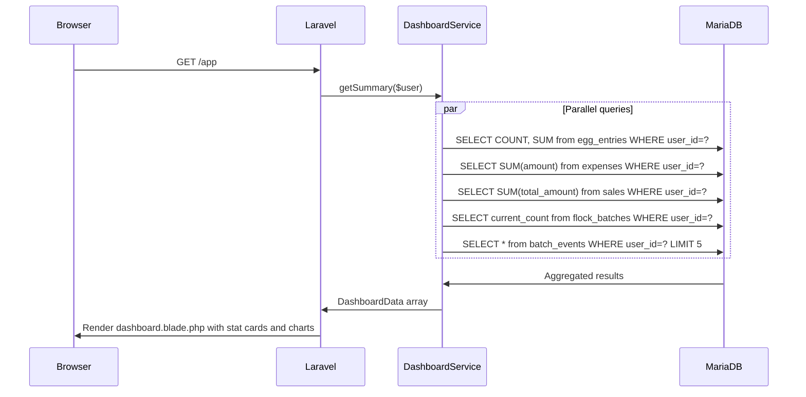
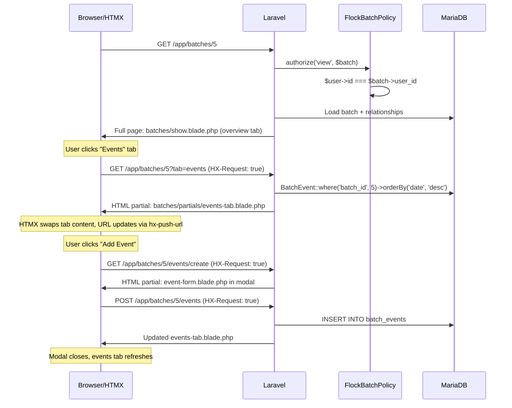
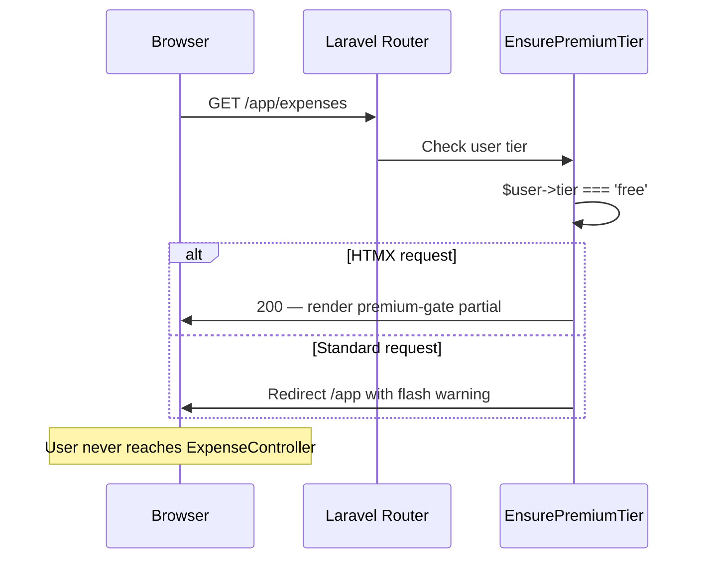
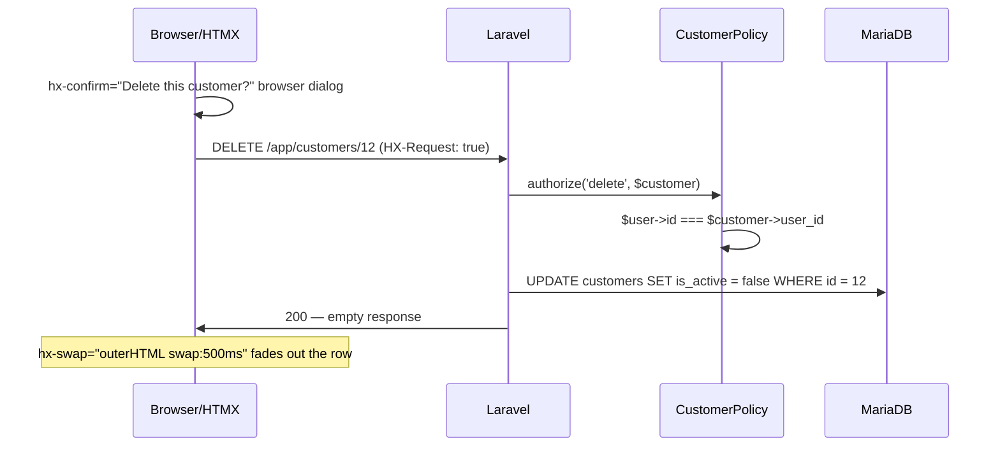
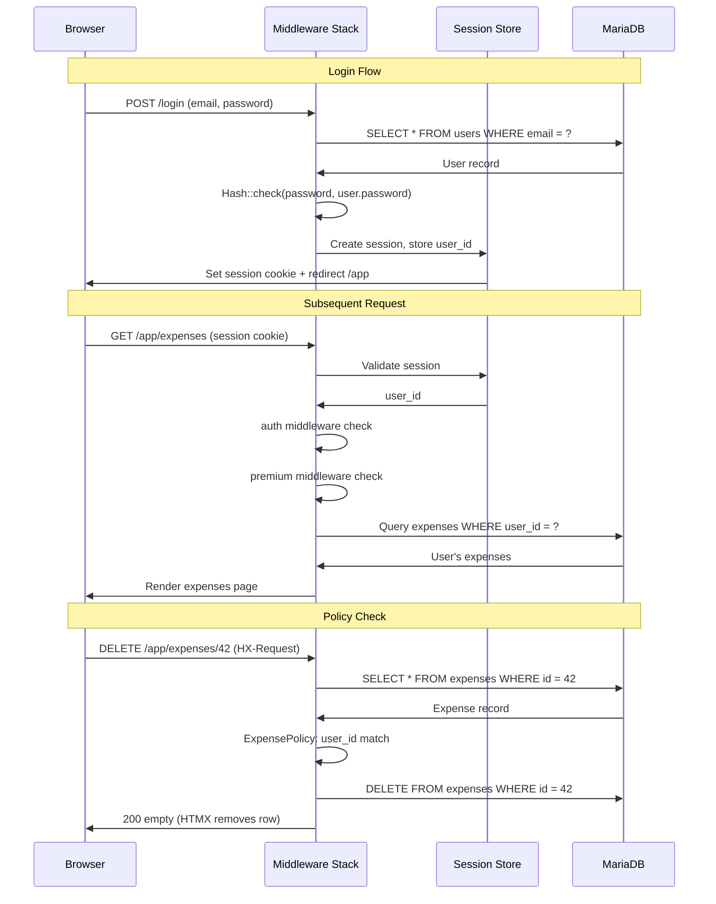

# ChickenCare Fullstack Architecture Document

## Introduction

This document outlines the complete fullstack architecture for ChickenCare, a poultry farm management application being rebuilt from a React + Supabase + Netlify SPA into a **Laravel 12 + HTMX + Blade** monolithic application backed by **MariaDB 10.6.22**. It serves as the single source of truth for AI-driven development.

This rebuild is for **local testing purposes** with **full feature parity** against the existing production application at `d:\Koke\Aplikacija`. The goal is to replicate all domain features — egg tracking, flock/batch management, CRM, expenses, feed inventory, dashboard analytics, and premium tier gating — using a traditional server-rendered architecture enhanced with HTMX for dynamic interactivity without a JavaScript framework.

### Starter Template or Existing Project

**Brownfield rebuild** — This is a full rebuild of the existing Chicken Manager application (React 19 + Supabase + Netlify). The existing app's database schema, business logic, and feature set are the requirements source. We use **Laravel Breeze (Blade)** as the starter kit for authentication scaffolding with Tailwind stripped out and replaced by pure SCSS.

### Change Log

| Date | Version | Description | Author |
|------|---------|-------------|--------|
| 2026-04-07 | 1.0 | Initial fullstack architecture for Laravel + HTMX rebuild | Winston |
| 2026-04-08 | 1.1 | Added accessibility standards (WCAG AA), pinned PHP 8.3, updated component templates with ARIA | Winston |
| 2026-04-08 | 1.2 | Added Laravel Boost MCP server for AI-assisted development | Winston |

---

## High Level Architecture

### Technical Summary

ChickenCare is a **server-rendered monolithic web application** built on **Laravel 12 with Blade templates and HTMX** for dynamic interactivity. The application uses **MariaDB 10.6.22** for persistent storage, **Laravel Breeze** for authentication scaffolding, and **pure SCSS** for styling. All business logic lives in Laravel controllers and services, with HTMX providing partial page updates, inline forms, and modal interactions without full page reloads. The architecture is optimized for **local development** using `php artisan serve` with no external infrastructure dependencies. MariaDB runs in a Docker container for easy management.

### Platform and Infrastructure Choice

**Platform:** Local development stack (PHP + MariaDB in Docker)
**Key Services:** Laravel 12, PHP 8.3, MariaDB 10.6.22 (Docker), Laravel Breeze, HTMX
**Deployment Host:** Local only (`127.0.0.1:8000`)

No cloud services, no serverless functions, no CDN. Everything runs on the local machine. This replaces:
- Supabase → MariaDB + Laravel Auth
- Netlify Functions → Laravel Controllers
- Netlify CDN → `php artisan serve`
- React SPA → Blade + HTMX

### Repository Structure

**Structure:** Single Laravel project (standard `laravel new` scaffold)
**Monorepo Tool:** N/A — single application, no package splitting needed
**Package Organization:** Standard Laravel conventions — `app/`, `resources/`, `routes/`, `database/`

### High Level Architecture Diagram

```mermaid
graph TB
    subgraph "Browser"
        HTML[Blade HTML + SCSS]
        HTMX[HTMX Engine]
        Alpine[Alpine.js - minimal client logic]
        HTML --> HTMX
        HTML --> Alpine
    end

    subgraph "Laravel Application"
        Router[Laravel Router]
        Middleware[Auth Middleware + Tier Middleware]
        
        subgraph "Controllers"
            DashboardCtrl[DashboardController]
            EggCtrl[EggEntryController]
            FlockCtrl[FlockProfileController]
            BatchCtrl[FlockBatchController]
            ExpenseCtrl[ExpenseController]
            FeedCtrl[FeedInventoryController]
            CRMCtrl[CustomerController]
            SaleCtrl[SaleController]
            DeathCtrl[DeathRecordController]
            BatchEventCtrl[BatchEventController]
        end

        subgraph "Service Layer"
            DashboardSvc[DashboardService]
            ReportSvc[ReportService]
            FlockSvc[FlockSummaryService]
        end

        subgraph "Eloquent Models"
            Models[User, FlockProfile, EggEntry,<br/>Expense, FeedInventory, Customer,<br/>Sale, FlockBatch, DeathRecord,<br/>BatchEvent, FlockEvent]
        end

        Router --> Middleware
        Middleware --> Controllers
        Controllers --> Service Layer
        Controllers --> Models
        Service Layer --> Models
    end

    subgraph "Database"
        MariaDB[(MariaDB 10.6.22<br/>Docker Container)]
        Models --> MariaDB
    end

    HTMX -->|HTTP Requests| Router
    Router -->|HTML Partials| HTMX
```

### Architectural Patterns

- **MVC (Model-View-Controller):** Laravel's native pattern — Models for data, Controllers for logic, Blade views for presentation. _Rationale:_ Industry standard, excellent tooling, maps directly to the existing app's domain structure.

- **Server-Side Rendering + HTMX Hypermedia:** Controllers return full pages or HTML partials (for HTMX requests). No JSON API needed. _Rationale:_ Eliminates the entire client-side state management layer (React Context, hooks, caching) — the server is the single source of truth.

- **Service Layer for Complex Logic:** Dashboard aggregations, reports, and flock summaries live in dedicated service classes rather than bloating controllers. _Rationale:_ Keeps controllers thin; mirrors the existing app's service layer pattern.

- **Policy-Based Authorization:** Laravel Policies replace Supabase RLS — each model gets a policy ensuring users only access their own data. _Rationale:_ Same user isolation guarantee, but enforced at application level with Laravel's built-in `authorize()`.

- **Blade Component Architecture:** Reusable Blade components (`<x-stat-card>`, `<x-data-table>`, `<x-form-group>`) replace the React shared UI library. _Rationale:_ Mirrors the existing component library structure while staying server-rendered.

---

## Tech Stack

| Category | Technology | Version | Purpose | Rationale |
|----------|-----------|---------|---------|-----------|
| Backend Language | PHP | 8.3 | Server-side logic | Laravel 12 requirement, modern type support, pinned for consistency |
| Backend Framework | Laravel | 12.x | Full-stack framework | MVC, Eloquent ORM, migrations, auth, policies |
| Auth Starter | Laravel Breeze | latest | Auth scaffolding (Blade) | Login, register, password reset out of the box |
| Frontend Interactivity | HTMX | 2.0.x | Dynamic partial page updates | SPA-like UX without JavaScript framework |
| Client-Side Micro-Logic | Alpine.js | 3.x | Dropdowns, toggles, tabs | Standard HTMX companion for small UI state |
| CSS Preprocessor | SCSS (Sass) | latest | Custom styling | Nesting, variables, mixins — no framework dependency |
| Build Tool | Vite | 6.x | Asset compilation | Ships with Laravel, handles SCSS + JS bundling |
| Database | MariaDB | 10.6.22 | Persistent storage (Docker) | User-specified, MySQL-compatible with Eloquent |
| ORM | Eloquent | (Laravel) | Database abstraction | Relationships, scopes, mutators, built-in |
| Charts | Chart.js | 4.x | Dashboard visualizations | Lightweight, no React dependency (replaces Recharts) |
| Icons | Lucide (SVG) | latest | UI icons | Blade includes of SVGs, no JS runtime needed |
| Form Validation | Laravel Validation | (Laravel) | Server-side validation | Form Requests replace Zod + React Hook Form |
| Testing (Unit) | PHPUnit | 11.x | Backend unit tests | Laravel's default testing framework |
| Testing (Feature) | Laravel HTTP Tests | (Laravel) | Route/controller testing | Built-in request simulation |
| Testing (Browser) | Laravel Dusk | latest | E2E browser testing (optional) | Chrome-based, replaces Playwright |
| Monitoring | Laravel Telescope | latest | Local debug/monitoring | Request inspection, queries, mail — local only |
| Logging | Laravel Log | (Laravel) | Application logging | File-based, replaces Sentry for local use |
| Migrations | Laravel Migrations | (Laravel) | Schema versioning | Replaces Supabase migrations |
| AI Dev Tools | Laravel Boost | latest | MCP server for AI-assisted development | Gives AI agents schema, routes, config, docs, tinker access |
| Package Manager | pnpm | latest | Frontend dependency management | Faster, stricter, disk-efficient |

### Key Replacements from Original Stack

| Original | Laravel Replacement |
|----------|-------------------|
| React 19 + React Router | Blade templates + Laravel routes |
| Supabase Auth + RLS | Laravel Breeze + Policies |
| Supabase PostgreSQL | MariaDB 10.6.22 (Docker) + Eloquent |
| Netlify Functions (10) | Laravel Controllers |
| React Context + Hooks | Server-side — no client state management |
| Tailwind CSS | Pure SCSS |
| Recharts | Chart.js |
| Zod + React Hook Form | Laravel Form Requests |
| Framer Motion | CSS transitions + HTMX swap animations |
| Sentry | Laravel Telescope (local) |
| npm | pnpm |

---

## Data Models

### User (extends Laravel Breeze)

**Purpose:** Authenticated user with tier support (free/premium)

**Key Attributes:**
- `id`: bigint (PK, auto-increment)
- `name`: string — display name
- `email`: string (unique) — login credential
- `password`: string — hashed
- `tier`: enum('free', 'premium') — feature gating
- `is_admin`: boolean — admin access flag
- `email_verified_at`, `created_at`, `updated_at`: timestamps

**Relationships:**
- Has one `FlockProfile`
- Has many `EggEntry`, `Expense`, `FeedInventory`, `Customer`, `Sale`, `FlockBatch`

### FlockProfile

**Purpose:** Farm and flock configuration per user

**Key Attributes:**
- `id`: bigint (PK)
- `user_id`: FK → users (unique — one profile per user)
- `farm_name`: string (default: 'My Chicken Farm')
- `location`: string (nullable)
- `flock_size`: integer
- `breed`: string (nullable) — comma-separated breeds
- `start_date`: date (nullable)
- `hens`: integer (default: 0)
- `roosters`: integer (default: 0)
- `chicks`: integer (default: 0)
- `brooding`: integer (default: 0)
- `notes`: text (nullable)

**Relationships:**
- Belongs to `User`
- Has many `FlockEvent`

### EggEntry

**Purpose:** Daily egg production records

**Key Attributes:**
- `id`: bigint (PK)
- `user_id`: FK → users
- `date`: date
- `count`: integer (min: 0)
- `size`: enum('small', 'medium', 'large', 'extra-large', 'jumbo') — nullable
- `color`: enum('white', 'brown', 'blue', 'green', 'speckled', 'cream') — nullable
- `notes`: text (nullable)

**Relationships:**
- Belongs to `User`

### FlockEvent

**Purpose:** Timeline milestones in the flock's lifecycle

**Key Attributes:**
- `id`: bigint (PK)
- `flock_profile_id`: FK → flock_profiles
- `date`: date
- `type`: enum('acquisition', 'laying_start', 'broody', 'hatching', 'other')
- `description`: string
- `affected_birds`: integer (nullable)
- `notes`: text (nullable)

**Relationships:**
- Belongs to `FlockProfile`

### FeedInventory

**Purpose:** Feed purchases and inventory tracking

**Key Attributes:**
- `id`: bigint (PK)
- `user_id`: FK → users
- `name`: string — feed name/brand
- `quantity`: decimal(10,2) (min: 0)
- `unit`: enum('kg', 'lbs')
- `purchase_date`: date (nullable)
- `expiry_date`: date (nullable)
- `total_cost`: decimal(10,2) (nullable)

**Relationships:**
- Belongs to `User`

### Expense

**Purpose:** Farm-related cost tracking

**Key Attributes:**
- `id`: bigint (PK)
- `user_id`: FK → users
- `date`: date
- `category`: string — (feed, medical, equipment, housing, utilities, other)
- `description`: string
- `amount`: decimal(10,2) (min: 0)

**Relationships:**
- Belongs to `User`

### Customer

**Purpose:** Egg buyer / customer records for CRM

**Key Attributes:**
- `id`: bigint (PK)
- `user_id`: FK → users
- `name`: string
- `phone`: string (nullable)
- `notes`: text (nullable)
- `is_active`: boolean (default: true) — soft filtering

**Relationships:**
- Belongs to `User`
- Has many `Sale`

### Sale

**Purpose:** Egg sale transactions

**Key Attributes:**
- `id`: bigint (PK)
- `user_id`: FK → users
- `customer_id`: FK → customers (nullable)
- `sale_date`: date
- `dozen_count`: integer (default: 0, min: 0)
- `individual_count`: integer (default: 0, min: 0)
- `total_amount`: decimal(10,2) (min: 0)
- `paid`: boolean (default: false)
- `notes`: text (nullable)

**Relationships:**
- Belongs to `User`
- Belongs to `Customer` (nullable)

### FlockBatch

**Purpose:** Individual batches of birds with lifecycle management

**Key Attributes:**
- `id`: bigint (PK)
- `user_id`: FK → users
- `batch_name`: string
- `breed`: string
- `acquisition_date`: date
- `initial_count`: integer (min: 1)
- `current_count`: integer (min: 0)
- `hens_count`: integer (default: 0)
- `roosters_count`: integer (default: 0)
- `chicks_count`: integer (default: 0)
- `brooding_count`: integer (default: 0)
- `type`: enum('hens', 'roosters', 'chicks', 'mixed')
- `age_at_acquisition`: enum('chick', 'juvenile', 'adult')
- `expected_laying_start_date`: date (nullable)
- `actual_laying_start_date`: date (nullable)
- `source`: string
- `cost`: decimal(10,2) (default: 0.00)
- `notes`: text (nullable)
- `is_active`: boolean (default: true)

**Relationships:**
- Belongs to `User`
- Has many `DeathRecord`
- Has many `BatchEvent`

### DeathRecord

**Purpose:** Mortality tracking per batch

**Key Attributes:**
- `id`: bigint (PK)
- `user_id`: FK → users
- `batch_id`: FK → flock_batches
- `date`: date
- `count`: integer (min: 1)
- `cause`: enum('predator', 'disease', 'age', 'injury', 'unknown', 'culled', 'other')
- `description`: string
- `notes`: text (nullable)

**Relationships:**
- Belongs to `User`
- Belongs to `FlockBatch`

### BatchEvent

**Purpose:** Lifecycle events per batch

**Key Attributes:**
- `id`: bigint (PK)
- `user_id`: FK → users
- `batch_id`: FK → flock_batches
- `date`: date
- `type`: enum('health_check', 'vaccination', 'relocation', 'breeding', 'laying_start', 'brooding_start', 'brooding_stop', 'production_note', 'flock_added', 'flock_loss', 'other')
- `description`: string
- `affected_count`: integer (nullable, min: 1)
- `notes`: text (nullable)

**Relationships:**
- Belongs to `User`
- Belongs to `FlockBatch`

### Entity Relationship Overview



---

## API Specification (Routes + HTMX)

Since we use **Laravel + HTMX** (server-rendered), there is no traditional JSON API. Controllers return either full Blade views (standard navigation) or HTML partials (HTMX requests with `HX-Request` header).

### Route Architecture

```
# Authentication (Laravel Breeze)
GET    /login                          → Auth\LoginController@create
POST   /login                          → Auth\LoginController@store
POST   /logout                         → Auth\LoginController@destroy
GET    /register                       → Auth\RegisterController@create
POST   /register                       → Auth\RegisterController@store
GET    /forgot-password                → Auth\ForgotPasswordController@create
POST   /forgot-password                → Auth\ForgotPasswordController@store
GET    /reset-password/{token}         → Auth\ResetPasswordController@create
POST   /reset-password                 → Auth\ResetPasswordController@store

# Public
GET    /                               → LandingController@index
GET    /costs                          → LandingController@costs

# Protected (auth middleware) ─────────────────────────────
# Prefix: /app

GET    /app                            → DashboardController@index

# Egg Tracking (free tier)
GET    /app/eggs                       → EggEntryController@index
POST   /app/eggs                       → EggEntryController@store
PUT    /app/eggs/{egg}                 → EggEntryController@update
DELETE /app/eggs/{egg}                 → EggEntryController@destroy

# Flock Profile (premium)
GET    /app/flock                      → FlockProfileController@index
POST   /app/flock                      → FlockProfileController@store
PUT    /app/flock                      → FlockProfileController@update

# Flock Events
POST   /app/flock/events               → FlockEventController@store
PUT    /app/flock/events/{event}       → FlockEventController@update
DELETE /app/flock/events/{event}       → FlockEventController@destroy

# Flock Batches (premium)
GET    /app/batches                    → FlockBatchController@index
GET    /app/batches/{batch}            → FlockBatchController@show
POST   /app/batches                    → FlockBatchController@store
PUT    /app/batches/{batch}            → FlockBatchController@update
DELETE /app/batches/{batch}            → FlockBatchController@destroy

# Batch Events
POST   /app/batches/{batch}/events     → BatchEventController@store
PUT    /app/batches/{batch}/events/{event} → BatchEventController@update
DELETE /app/batches/{batch}/events/{event} → BatchEventController@destroy

# Death Records
POST   /app/batches/{batch}/deaths     → DeathRecordController@store
PUT    /app/batches/{batch}/deaths/{death} → DeathRecordController@update
DELETE /app/batches/{batch}/deaths/{death} → DeathRecordController@destroy

# Expenses (premium)
GET    /app/expenses                   → ExpenseController@index
POST   /app/expenses                   → ExpenseController@store
PUT    /app/expenses/{expense}         → ExpenseController@update
DELETE /app/expenses/{expense}         → ExpenseController@destroy

# Feed Inventory (premium)
GET    /app/feed                       → FeedInventoryController@index
POST   /app/feed                       → FeedInventoryController@store
PUT    /app/feed/{feed}                → FeedInventoryController@update
DELETE /app/feed/{feed}                → FeedInventoryController@destroy

# Savings / Financial Analysis (premium)
GET    /app/savings                    → SavingsController@index

# Viability Calculator (premium)
GET    /app/viability                  → ViabilityController@index

# CRM - Customers (premium)
GET    /app/customers                  → CustomerController@index
POST   /app/customers                  → CustomerController@store
PUT    /app/customers/{customer}       → CustomerController@update
DELETE /app/customers/{customer}       → CustomerController@destroy

# CRM - Sales (premium)
GET    /app/sales                      → SaleController@index
POST   /app/sales                      → SaleController@store
PUT    /app/sales/{sale}               → SaleController@update
DELETE /app/sales/{sale}               → SaleController@destroy

# Sales Reports
GET    /app/sales/reports              → SalesReportController@index

# Account Settings
GET    /app/account                    → AccountController@edit
PUT    /app/account                    → AccountController@update
```

### HTMX Request/Response Contract

Every controller method detects HTMX requests and responds accordingly:

```php
public function store(StoreEggEntryRequest $request)
{
    $entry = $request->user()->eggEntries()->create($request->validated());

    if ($request->header('HX-Request')) {
        return view('eggs.partials.entry-row', compact('entry'));
    }

    return redirect()->route('eggs.index')->with('success', 'Entry added.');
}
```

### Key HTMX Patterns

| Pattern | HTMX Attribute | Use Case |
|---------|---------------|----------|
| Inline create | `hx-post` + `hx-target="#list"` + `hx-swap="afterbegin"` | Add egg entry, expense, sale |
| Inline edit | `hx-put` + `hx-target="this"` + `hx-swap="outerHTML"` | Edit customer, batch details |
| Delete with confirm | `hx-delete` + `hx-confirm` + `hx-target="closest tr"` + `hx-swap="outerHTML swap:500ms"` | Remove records with fade-out |
| Modal forms | `hx-get` + `hx-target="#modal-container"` | Batch detail view, event forms |
| Pagination | `hx-get="?page=N"` + `hx-target="#table-body"` + `hx-push-url="true"` | Egg entries, expenses, sales lists |
| Dashboard refresh | `hx-get` + `hx-trigger="load, every 60s"` | Dashboard stat cards |
| Search/filter | `hx-get` + `hx-trigger="keyup changed delay:300ms"` | Customer search, batch filtering |
| Tab switching | `hx-get="/app/flock?tab=events"` + `hx-target="#tab-content"` | Profile tabs, batch detail tabs |

---

## Components

### Blade Layout Components

**`<x-app-layout>`** — Main authenticated layout: sidebar navigation, top bar, user menu, flash messages, HTMX/Alpine includes.

**`<x-guest-layout>`** — Public/unauthenticated layout: landing page, login, register.

**`<x-sidebar>`** — Navigation menu with active state highlighting, tier-based feature visibility, responsive collapse.

### Reusable UI Blade Components

| Blade Component | Replaces React Component | Purpose |
|----------------|------------------------|---------|
| `<x-ui.stat-card>` | `StatCard` | Dashboard metric display with icon, value, label, trend |
| `<x-ui.progress-card>` | `ProgressCard` | Progress bar card for targets/goals |
| `<x-ui.empty-state>` | `EmptyState` | Friendly message when no data exists |
| `<x-ui.flash>` | N/A | Toast/flash message with auto-dismiss |
| `<x-ui.timeline>` | `EventTimeline` | Chronological event display |
| `<x-ui.chart>` | N/A | Chart.js canvas wrapper |
| `<x-forms.input>` | `TextInput` / `NumberInput` | Text/number input with error state |
| `<x-forms.select>` | `SelectInput` | Dropdown select with error state |
| `<x-forms.textarea>` | `TextareaInput` | Textarea with error state |
| `<x-forms.date-input>` | `DateInput` | Date picker input |
| `<x-forms.form-card>` | `FormCard` | Styled card wrapping a form |
| `<x-forms.form-group>` | `FormGroup` | Label + input + error message wrapper |
| `<x-forms.form-row>` | `FormRow` | Horizontal group of form fields |
| `<x-forms.submit-button>` | `SubmitButton` | Form submit button |
| `<x-tables.data-table>` | `DataTable` | Sortable table with optional HTMX pagination |
| `<x-tables.pagination>` | `Pagination` | Page navigation using Laravel's paginator |
| `<x-modals.modal>` | `FormModal` / `ConfirmDialog` | HTMX-powered modal dialog |
| `<x-modals.confirm-delete>` | `AlertDialog` | Delete confirmation with HTMX |
| `<x-layout.page-header>` | N/A | Page title and subtitle |
| `<x-layout.section>` | N/A | Content section wrapper |
| `<x-premium-gate>` | `PremiumFeatureGate` | Shows upgrade prompt for free-tier users |

### Controllers

| Controller | Feature | Tier | Key Actions |
|-----------|---------|------|-------------|
| `LandingController` | Public pages | public | `index`, `costs` |
| `DashboardController` | Dashboard analytics | auth | `index` — aggregates data from all models |
| `EggEntryController` | Egg tracking | free | Full CRUD + pagination |
| `FlockProfileController` | Flock profile | premium | `index`, `store`, `update` |
| `FlockEventController` | Flock timeline | premium | `store`, `update`, `destroy` |
| `FlockBatchController` | Batch management | premium | Full CRUD + detail view |
| `BatchEventController` | Batch events | premium | `store`, `update`, `destroy` (nested) |
| `DeathRecordController` | Mortality tracking | premium | `store`, `update`, `destroy` (nested) |
| `ExpenseController` | Expense tracking | premium | Full CRUD + pagination |
| `FeedInventoryController` | Feed management | premium | Full CRUD |
| `CustomerController` | CRM customers | premium | Full CRUD + search |
| `SaleController` | Sales tracking | premium | Full CRUD + pagination |
| `SalesReportController` | Sales analytics | premium | `index` — read-only aggregations |
| `SavingsController` | Financial analysis | premium | `index` — read-only calculations |
| `ViabilityController` | Viability calc | premium | `index` — calculator page |
| `AccountController` | User settings | auth | `edit`, `update` |

### Service Classes

| Service | Responsibility | Key Interface |
|---------|---------------|---------------|
| `DashboardService` | Aggregates data across all models for dashboard | `getSummary(User): array` |
| `ReportService` | Sales report generation — totals by period, per-customer breakdowns | `getSalesReport(User, ?from, ?to): array` |
| `FlockSummaryService` | Flock data across batches — total birds, mortality, breed distribution | `getFlockSummary(User): array` |
| `SavingsService` | Financial analysis — income vs expenses, profit margins, cost per egg | `getFinancialAnalysis(User): array` |
| `ViabilityService` | Viability calculations — cost/profit per bird, break-even | `calculate(User, array): array` |

### Middleware

| Middleware | Purpose |
|-----------|---------|
| `auth` (Breeze) | Ensures user is logged in |
| `EnsurePremiumTier` | Blocks free-tier users from premium routes |
| `DetectHtmx` | Sets `$request->isHtmx()` helper |

### Form Requests (Validation)

| Form Request | Validates |
|-------------|-----------|
| `StoreEggEntryRequest` | date, count, size, color, notes |
| `UpdateEggEntryRequest` | same as above |
| `StoreExpenseRequest` | date, category, description, amount |
| `StoreFlockProfileRequest` | farm_name, location, breed, hens, roosters, etc. |
| `StoreFlockBatchRequest` | batch_name, breed, acquisition_date, initial_count, type, age_at_acquisition, source, cost |
| `UpdateFlockBatchRequest` | same as above |
| `StoreSaleRequest` | customer_id, sale_date, dozen_count, individual_count, total_amount, paid |
| `StoreCustomerRequest` | name, phone, notes |
| `StoreDeathRecordRequest` | batch_id, date, count, cause, description |
| `StoreBatchEventRequest` | batch_id, date, type, description, affected_count |
| `StoreFlockEventRequest` | flock_profile_id, date, type, description, affected_birds |
| `StoreFeedInventoryRequest` | name, quantity, unit, purchase_date, expiry_date, total_cost |

### Policies (Authorization)

One per model — all follow the same ownership pattern:

```php
class EggEntryPolicy
{
    public function view(User $user, EggEntry $entry): bool
    {
        return $user->id === $entry->user_id;
    }

    public function update(User $user, EggEntry $entry): bool
    {
        return $user->id === $entry->user_id;
    }

    public function delete(User $user, EggEntry $entry): bool
    {
        return $user->id === $entry->user_id;
    }
}
```

**Policies:** `EggEntryPolicy`, `FlockProfilePolicy`, `FlockEventPolicy`, `FlockBatchPolicy`, `BatchEventPolicy`, `DeathRecordPolicy`, `ExpensePolicy`, `FeedInventoryPolicy`, `CustomerPolicy`, `SalePolicy`

---

## External APIs

**No external APIs required.** All functionality is self-contained within the Laravel application and MariaDB database. The original app's Supabase, Sentry, Netlify, and LemonSqueezy integrations are replaced by local equivalents.

Frontend libraries (HTMX, Alpine.js, Chart.js) are installed via pnpm and bundled with Vite — no CDN calls needed.

---

## Core Workflows

### Workflow 1: User Registration & First Login



### Workflow 2: Add Egg Entry (HTMX Inline Create)



### Workflow 3: Dashboard Load (Multi-Model Aggregation)



### Workflow 4: Batch Detail View with Tabs (HTMX Tab Switching)



### Workflow 5: Premium Feature Gate



### Workflow 6: Delete with Confirmation (HTMX)



---

## Database Schema

### Full MariaDB 10.6.22 DDL

```sql
-- ============================================
-- ChickenCare Database Schema
-- MariaDB 10.6.22
-- ============================================

-- Users table (extended by Laravel Breeze)
ALTER TABLE users ADD COLUMN tier ENUM('free', 'premium') NOT NULL DEFAULT 'free' AFTER remember_token;
ALTER TABLE users ADD COLUMN is_admin TINYINT(1) NOT NULL DEFAULT 0 AFTER tier;


CREATE TABLE flock_profiles (
    id BIGINT UNSIGNED AUTO_INCREMENT PRIMARY KEY,
    user_id BIGINT UNSIGNED NOT NULL,
    farm_name VARCHAR(255) NOT NULL DEFAULT 'My Chicken Farm',
    location VARCHAR(255) NULL,
    flock_size INT UNSIGNED NOT NULL DEFAULT 0,
    breed VARCHAR(500) NULL COMMENT 'Comma-separated breeds',
    start_date DATE NULL,
    hens INT UNSIGNED NOT NULL DEFAULT 0,
    roosters INT UNSIGNED NOT NULL DEFAULT 0,
    chicks INT UNSIGNED NOT NULL DEFAULT 0,
    brooding INT UNSIGNED NOT NULL DEFAULT 0,
    notes TEXT NULL,
    created_at TIMESTAMP NULL,
    updated_at TIMESTAMP NULL,
    CONSTRAINT fk_flock_profiles_user FOREIGN KEY (user_id) REFERENCES users(id) ON DELETE CASCADE,
    UNIQUE KEY uq_flock_profiles_user (user_id)
) ENGINE=InnoDB DEFAULT CHARSET=utf8mb4 COLLATE=utf8mb4_unicode_ci;


CREATE TABLE flock_events (
    id BIGINT UNSIGNED AUTO_INCREMENT PRIMARY KEY,
    flock_profile_id BIGINT UNSIGNED NOT NULL,
    date DATE NOT NULL,
    type ENUM('acquisition', 'laying_start', 'broody', 'hatching', 'other') NOT NULL,
    description VARCHAR(500) NOT NULL,
    affected_birds INT UNSIGNED NULL,
    notes TEXT NULL,
    created_at TIMESTAMP NULL,
    updated_at TIMESTAMP NULL,
    CONSTRAINT fk_flock_events_profile FOREIGN KEY (flock_profile_id) REFERENCES flock_profiles(id) ON DELETE CASCADE,
    INDEX idx_flock_events_profile_date (flock_profile_id, date)
) ENGINE=InnoDB DEFAULT CHARSET=utf8mb4 COLLATE=utf8mb4_unicode_ci;


CREATE TABLE egg_entries (
    id BIGINT UNSIGNED AUTO_INCREMENT PRIMARY KEY,
    user_id BIGINT UNSIGNED NOT NULL,
    date DATE NOT NULL,
    count INT UNSIGNED NOT NULL DEFAULT 0,
    size ENUM('small', 'medium', 'large', 'extra-large', 'jumbo') NULL,
    color ENUM('white', 'brown', 'blue', 'green', 'speckled', 'cream') NULL,
    notes TEXT NULL,
    created_at TIMESTAMP NULL,
    updated_at TIMESTAMP NULL,
    CONSTRAINT fk_egg_entries_user FOREIGN KEY (user_id) REFERENCES users(id) ON DELETE CASCADE,
    INDEX idx_egg_entries_user_date (user_id, date DESC)
) ENGINE=InnoDB DEFAULT CHARSET=utf8mb4 COLLATE=utf8mb4_unicode_ci;


CREATE TABLE feed_inventory (
    id BIGINT UNSIGNED AUTO_INCREMENT PRIMARY KEY,
    user_id BIGINT UNSIGNED NOT NULL,
    name VARCHAR(255) NOT NULL,
    quantity DECIMAL(10,2) NOT NULL DEFAULT 0.00,
    unit ENUM('kg', 'lbs') NOT NULL,
    purchase_date DATE NULL,
    expiry_date DATE NULL,
    total_cost DECIMAL(10,2) NULL,
    created_at TIMESTAMP NULL,
    updated_at TIMESTAMP NULL,
    CONSTRAINT fk_feed_inventory_user FOREIGN KEY (user_id) REFERENCES users(id) ON DELETE CASCADE,
    CONSTRAINT chk_feed_quantity CHECK (quantity >= 0),
    INDEX idx_feed_inventory_user (user_id, purchase_date DESC)
) ENGINE=InnoDB DEFAULT CHARSET=utf8mb4 COLLATE=utf8mb4_unicode_ci;


CREATE TABLE expenses (
    id BIGINT UNSIGNED AUTO_INCREMENT PRIMARY KEY,
    user_id BIGINT UNSIGNED NOT NULL,
    date DATE NOT NULL,
    category VARCHAR(100) NOT NULL,
    description VARCHAR(500) NOT NULL,
    amount DECIMAL(10,2) NOT NULL,
    created_at TIMESTAMP NULL,
    updated_at TIMESTAMP NULL,
    CONSTRAINT fk_expenses_user FOREIGN KEY (user_id) REFERENCES users(id) ON DELETE CASCADE,
    CONSTRAINT chk_expense_amount CHECK (amount >= 0),
    INDEX idx_expenses_user_date (user_id, date DESC)
) ENGINE=InnoDB DEFAULT CHARSET=utf8mb4 COLLATE=utf8mb4_unicode_ci;


CREATE TABLE customers (
    id BIGINT UNSIGNED AUTO_INCREMENT PRIMARY KEY,
    user_id BIGINT UNSIGNED NOT NULL,
    name VARCHAR(255) NOT NULL,
    phone VARCHAR(50) NULL,
    notes TEXT NULL,
    is_active TINYINT(1) NOT NULL DEFAULT 1,
    created_at TIMESTAMP NULL,
    updated_at TIMESTAMP NULL,
    CONSTRAINT fk_customers_user FOREIGN KEY (user_id) REFERENCES users(id) ON DELETE CASCADE,
    INDEX idx_customers_user (user_id),
    INDEX idx_customers_active (user_id, is_active)
) ENGINE=InnoDB DEFAULT CHARSET=utf8mb4 COLLATE=utf8mb4_unicode_ci;


CREATE TABLE sales (
    id BIGINT UNSIGNED AUTO_INCREMENT PRIMARY KEY,
    user_id BIGINT UNSIGNED NOT NULL,
    customer_id BIGINT UNSIGNED NULL,
    sale_date DATE NOT NULL,
    dozen_count INT UNSIGNED NOT NULL DEFAULT 0,
    individual_count INT UNSIGNED NOT NULL DEFAULT 0,
    total_amount DECIMAL(10,2) NOT NULL DEFAULT 0.00,
    paid TINYINT(1) NOT NULL DEFAULT 0,
    notes TEXT NULL,
    created_at TIMESTAMP NULL,
    updated_at TIMESTAMP NULL,
    CONSTRAINT fk_sales_user FOREIGN KEY (user_id) REFERENCES users(id) ON DELETE CASCADE,
    CONSTRAINT fk_sales_customer FOREIGN KEY (customer_id) REFERENCES customers(id) ON DELETE SET NULL,
    CONSTRAINT chk_sales_amount CHECK (total_amount >= 0),
    CONSTRAINT chk_sales_dozen CHECK (dozen_count >= 0),
    CONSTRAINT chk_sales_individual CHECK (individual_count >= 0),
    INDEX idx_sales_user_date (user_id, sale_date DESC),
    INDEX idx_sales_customer (customer_id)
) ENGINE=InnoDB DEFAULT CHARSET=utf8mb4 COLLATE=utf8mb4_unicode_ci;


CREATE TABLE flock_batches (
    id BIGINT UNSIGNED AUTO_INCREMENT PRIMARY KEY,
    user_id BIGINT UNSIGNED NOT NULL,
    batch_name VARCHAR(255) NOT NULL,
    breed VARCHAR(255) NOT NULL,
    acquisition_date DATE NOT NULL,
    initial_count INT UNSIGNED NOT NULL,
    current_count INT UNSIGNED NOT NULL DEFAULT 0,
    hens_count INT UNSIGNED NOT NULL DEFAULT 0,
    roosters_count INT UNSIGNED NOT NULL DEFAULT 0,
    chicks_count INT UNSIGNED NOT NULL DEFAULT 0,
    brooding_count INT UNSIGNED NOT NULL DEFAULT 0,
    type ENUM('hens', 'roosters', 'chicks', 'mixed') NOT NULL,
    age_at_acquisition ENUM('chick', 'juvenile', 'adult') NOT NULL,
    expected_laying_start_date DATE NULL,
    actual_laying_start_date DATE NULL,
    source VARCHAR(255) NOT NULL,
    cost DECIMAL(10,2) NOT NULL DEFAULT 0.00,
    notes TEXT NULL,
    is_active TINYINT(1) NOT NULL DEFAULT 1,
    created_at TIMESTAMP NULL,
    updated_at TIMESTAMP NULL,
    CONSTRAINT fk_flock_batches_user FOREIGN KEY (user_id) REFERENCES users(id) ON DELETE CASCADE,
    CONSTRAINT chk_batch_initial CHECK (initial_count > 0),
    CONSTRAINT chk_batch_current CHECK (current_count >= 0),
    INDEX idx_flock_batches_user (user_id),
    INDEX idx_flock_batches_active (user_id, is_active)
) ENGINE=InnoDB DEFAULT CHARSET=utf8mb4 COLLATE=utf8mb4_unicode_ci;


CREATE TABLE death_records (
    id BIGINT UNSIGNED AUTO_INCREMENT PRIMARY KEY,
    user_id BIGINT UNSIGNED NOT NULL,
    batch_id BIGINT UNSIGNED NOT NULL,
    date DATE NOT NULL,
    count INT UNSIGNED NOT NULL,
    cause ENUM('predator', 'disease', 'age', 'injury', 'unknown', 'culled', 'other') NOT NULL,
    description VARCHAR(500) NOT NULL,
    notes TEXT NULL,
    created_at TIMESTAMP NULL,
    updated_at TIMESTAMP NULL,
    CONSTRAINT fk_death_records_user FOREIGN KEY (user_id) REFERENCES users(id) ON DELETE CASCADE,
    CONSTRAINT fk_death_records_batch FOREIGN KEY (batch_id) REFERENCES flock_batches(id) ON DELETE CASCADE,
    CONSTRAINT chk_death_count CHECK (count > 0),
    INDEX idx_death_records_batch (batch_id, date DESC)
) ENGINE=InnoDB DEFAULT CHARSET=utf8mb4 COLLATE=utf8mb4_unicode_ci;


CREATE TABLE batch_events (
    id BIGINT UNSIGNED AUTO_INCREMENT PRIMARY KEY,
    user_id BIGINT UNSIGNED NOT NULL,
    batch_id BIGINT UNSIGNED NOT NULL,
    date DATE NOT NULL,
    type ENUM('health_check', 'vaccination', 'relocation', 'breeding', 'laying_start', 'brooding_start', 'brooding_stop', 'production_note', 'flock_added', 'flock_loss', 'other') NOT NULL,
    description VARCHAR(500) NOT NULL,
    affected_count INT UNSIGNED NULL,
    notes TEXT NULL,
    created_at TIMESTAMP NULL,
    updated_at TIMESTAMP NULL,
    CONSTRAINT fk_batch_events_user FOREIGN KEY (user_id) REFERENCES users(id) ON DELETE CASCADE,
    CONSTRAINT fk_batch_events_batch FOREIGN KEY (batch_id) REFERENCES flock_batches(id) ON DELETE CASCADE,
    INDEX idx_batch_events_batch (batch_id, date DESC)
) ENGINE=InnoDB DEFAULT CHARSET=utf8mb4 COLLATE=utf8mb4_unicode_ci;
```

### Laravel Migration Mapping

```
database/migrations/
├── 0001_01_01_000000_create_users_table.php          # Breeze default
├── 0001_01_01_000001_create_cache_table.php           # Breeze default
├── 0001_01_01_000002_create_jobs_table.php            # Breeze default
├── 2026_04_07_000001_add_tier_and_admin_to_users.php
├── 2026_04_07_000002_create_flock_profiles_table.php
├── 2026_04_07_000003_create_flock_events_table.php
├── 2026_04_07_000004_create_egg_entries_table.php
├── 2026_04_07_000005_create_feed_inventory_table.php
├── 2026_04_07_000006_create_expenses_table.php
├── 2026_04_07_000007_create_customers_table.php
├── 2026_04_07_000008_create_sales_table.php
├── 2026_04_07_000009_create_flock_batches_table.php
├── 2026_04_07_000010_create_death_records_table.php
└── 2026_04_07_000011_create_batch_events_table.php
```

### Seeders

```
database/seeders/
├── DatabaseSeeder.php              # Master seeder
├── UserSeeder.php                  # 2 users: free + premium
├── FlockProfileSeeder.php          # 1 profile per user
├── FlockEventSeeder.php            # 5-10 events per profile
├── EggEntrySeeder.php              # 90 days of egg data per user
├── FeedInventorySeeder.php         # 5-8 feed entries per user
├── ExpenseSeeder.php               # 20-30 expenses per user
├── CustomerSeeder.php              # 5-10 customers per premium user
├── SaleSeeder.php                  # 30-50 sales per premium user
├── FlockBatchSeeder.php            # 3-5 batches per premium user
├── DeathRecordSeeder.php           # 2-5 records per batch
└── BatchEventSeeder.php            # 5-10 events per batch
```

---

## Frontend Architecture

### Component Organization

```
resources/views/
├── layouts/
│   ├── app.blade.php                # Authenticated layout
│   ├── guest.blade.php              # Public layout
│   └── landing.blade.php            # Landing page layout
├── components/
│   ├── ui/                          # stat-card, progress-card, empty-state, flash, timeline, chart
│   ├── forms/                       # input, select, textarea, date-input, form-card, form-group, form-row, submit-button
│   ├── tables/                      # data-table, pagination
│   ├── modals/                      # modal, confirm-delete
│   ├── layout/                      # sidebar, navbar, page-header, section
│   └── premium-gate.blade.php
├── dashboard/                       # index + partials/
├── eggs/                            # index + partials/
├── flock/                           # index + partials/
├── batches/                         # index, show + partials/
├── expenses/                        # index + partials/
├── feed/                            # index + partials/
├── customers/                       # index + partials/
├── sales/                           # index, reports + partials/
├── savings/                         # index
├── viability/                       # index
├── account/                         # edit
├── onboarding/                      # wizard + partials/
├── landing/                         # index, costs
└── auth/                            # login, register, forgot-password, reset-password
```

### SCSS Organization

```
resources/scss/
├── app.scss                          # Main entry — imports all partials
├── _variables.scss                   # Colors, spacing, typography, shadows
├── _mixins.scss                      # Neumorphic, card, form mixins
├── _base.scss                        # Reset, global typography
├── _layout.scss                      # App shell, sidebar, navbar, grid
├── _animations.scss                  # HTMX swap transitions, fade, slide
├── components/
│   ├── _buttons.scss
│   ├── _cards.scss
│   ├── _forms.scss
│   ├── _tables.scss
│   ├── _modals.scss
│   ├── _pagination.scss
│   ├── _timeline.scss
│   ├── _flash.scss
│   └── _badges.scss
└── features/
    ├── _dashboard.scss
    ├── _egg-counter.scss
    ├── _flock.scss
    ├── _batches.scss
    ├── _expenses.scss
    ├── _feed.scss
    ├── _crm.scss
    ├── _sales.scss
    ├── _savings.scss
    ├── _viability.scss
    ├── _landing.scss
    ├── _onboarding.scss
    └── _auth.scss
```

### Blade Component Pattern

```php
{{-- resources/views/components/forms/input.blade.php --}}
@props([
    'name',
    'label' => null,
    'type' => 'text',
    'value' => '',
    'required' => false,
    'placeholder' => '',
])

<div class="form-group @error($name) form-group--error @enderror">
    @if($label)
        <label for="{{ $name }}" class="form-label">
            {{ $label }}
            @if($required)<span class="form-label__required" aria-hidden="true">*</span>@endif
        </label>
    @endif

    <input
        type="{{ $type }}"
        id="{{ $name }}"
        name="{{ $name }}"
        value="{{ old($name, $value) }}"
        placeholder="{{ $placeholder }}"
        {{ $required ? 'required' : '' }}
        @error($name) aria-invalid="true" aria-describedby="{{ $name }}-error" @enderror
        {{ $attributes->merge(['class' => 'form-input']) }}
    >

    @error($name)
        <p class="form-error" id="{{ $name }}-error" role="alert">{{ $message }}</p>
    @enderror
</div>
```

### State Management

No client-side state management. The server is the single source of truth:

- **Page state** — Blade receives data from controller via `compact()`
- **Form state** — `old()` helper restores input on validation failure
- **Flash messages** — `session()->flash()` with auto-dismiss
- **Tab state** — URL query parameter `?tab=events`
- **Modal state** — Alpine.js `x-data` or HTMX loads content on demand
- **Filter/search state** — URL query parameters

### Routing

```php
// routes/web.php

Route::get('/', [LandingController::class, 'index'])->name('landing');
Route::get('/costs', [LandingController::class, 'costs'])->name('costs');

require __DIR__.'/auth.php';

Route::middleware(['auth', 'verified'])->prefix('app')->name('app.')->group(function () {
    Route::get('/', [DashboardController::class, 'index'])->name('dashboard');
    Route::resource('eggs', EggEntryController::class)->except(['create', 'edit', 'show']);
    Route::get('account', [AccountController::class, 'edit'])->name('account.edit');
    Route::put('account', [AccountController::class, 'update'])->name('account.update');

    Route::middleware('premium')->group(function () {
        Route::get('flock', [FlockProfileController::class, 'index'])->name('flock.index');
        Route::post('flock', [FlockProfileController::class, 'store'])->name('flock.store');
        Route::put('flock', [FlockProfileController::class, 'update'])->name('flock.update');
        Route::resource('flock/events', FlockEventController::class)
            ->only(['store', 'update', 'destroy'])->names('flock.events');

        Route::resource('batches', FlockBatchController::class);
        Route::resource('batches.events', BatchEventController::class)
            ->only(['store', 'update', 'destroy']);
        Route::resource('batches.deaths', DeathRecordController::class)
            ->only(['store', 'update', 'destroy']);

        Route::resource('expenses', ExpenseController::class)->except(['create', 'edit', 'show']);
        Route::resource('feed', FeedInventoryController::class)->except(['create', 'edit', 'show']);
        Route::get('savings', [SavingsController::class, 'index'])->name('savings.index');
        Route::get('viability', [ViabilityController::class, 'index'])->name('viability.index');

        Route::resource('customers', CustomerController::class)->except(['show']);
        Route::resource('sales', SaleController::class)->except(['create', 'edit', 'show']);
        Route::get('sales/reports', [SalesReportController::class, 'index'])->name('sales.reports');
    });
});
```

### App Layout

```html
{{-- resources/views/layouts/app.blade.php --}}
<!DOCTYPE html>
<html lang="{{ str_replace('_', '-', app()->getLocale()) }}">
<head>
    <meta charset="utf-8">
    <meta name="viewport" content="width=device-width, initial-scale=1">
    <meta name="csrf-token" content="{{ csrf_token() }}">
    <title>{{ config('app.name') }} — @yield('title', 'Dashboard')</title>
    @vite(['resources/scss/app.scss', 'resources/js/app.js'])
</head>
<body hx-headers='{"X-CSRF-TOKEN": "{{ csrf_token() }}"}'>
    <div class="app-layout">
        <x-layout.sidebar />
        <main class="app-layout__main">
            <x-layout.navbar />
            <x-ui.flash />
            <div class="app-layout__content" id="main-content">
                @yield('content')
            </div>
        </main>
    </div>
    <div id="modal-container" aria-live="polite"></div>
</body>
</html>
```

### JavaScript Entry Point

```javascript
// resources/js/app.js
import htmx from 'htmx.org';
import Alpine from 'alpinejs';
import Chart from 'chart.js/auto';

window.htmx = htmx;
window.Alpine = Alpine;
window.Chart = Chart;

// Handle 422 validation errors in HTMX
document.body.addEventListener('htmx:beforeSwap', function(evt) {
    if (evt.detail.xhr.status === 422) {
        evt.detail.shouldSwap = true;
        evt.detail.isError = false;
    }
});

// Close modal after successful form submission
document.body.addEventListener('htmx:afterSwap', function(evt) {
    if (evt.detail.xhr.getResponseHeader('HX-Trigger') === 'closeModal') {
        document.getElementById('modal-container').innerHTML = '';
    }
});

// Handle session expiry
document.body.addEventListener('htmx:responseError', function(evt) {
    if (evt.detail.xhr.status === 419) {
        window.location.href = '/login';
    }
});

Alpine.start();
```

---

## Backend Architecture

### Controller Pattern

```php
class EggEntryController extends Controller
{
    use HandlesHtmx;

    public function index(Request $request)
    {
        $entries = $request->user()
            ->eggEntries()
            ->orderBy('date', 'desc')
            ->paginate(15);

        if ($this->isHtmx($request) && $request->has('page')) {
            return view('eggs.partials.table', compact('entries'));
        }

        return view('eggs.index', compact('entries'));
    }

    public function store(StoreEggEntryRequest $request)
    {
        $entry = $request->user()
            ->eggEntries()
            ->create($request->validated());

        if ($this->isHtmx($request)) {
            return view('eggs.partials.entry-row', compact('entry'));
        }

        return redirect()->route('app.eggs.index')
            ->with('success', 'Egg entry recorded.');
    }

    public function update(StoreEggEntryRequest $request, EggEntry $egg)
    {
        $this->authorize('update', $egg);
        $egg->update($request->validated());

        if ($this->isHtmx($request)) {
            return view('eggs.partials.entry-row', ['entry' => $egg]);
        }

        return redirect()->route('app.eggs.index')
            ->with('success', 'Entry updated.');
    }

    public function destroy(Request $request, EggEntry $egg)
    {
        $this->authorize('delete', $egg);
        $egg->delete();

        if ($this->isHtmx($request)) {
            return response('', 200);
        }

        return redirect()->route('app.eggs.index')
            ->with('success', 'Entry deleted.');
    }
}
```

### HandlesHtmx Trait

```php
trait HandlesHtmx
{
    protected function isHtmx(Request $request): bool
    {
        return $request->hasHeader('HX-Request');
    }

    protected function htmxRedirect(string $url): Response
    {
        return response('', 200)->header('HX-Redirect', $url);
    }

    protected function htmxTrigger(string $event, $body = ''): Response
    {
        return response($body, 200)->header('HX-Trigger', $event);
    }
}
```

### Model Pattern

```php
class EggEntry extends Model
{
    protected $fillable = ['date', 'count', 'size', 'color', 'notes'];

    protected $casts = [
        'date' => 'date',
        'count' => 'integer',
    ];

    public function user(): BelongsTo
    {
        return $this->belongsTo(User::class);
    }

    public function scopeForWeek(Builder $query, ?Carbon $date = null): Builder
    {
        $date ??= now();
        return $query->whereBetween('date', [
            $date->startOfWeek(), $date->endOfWeek(),
        ]);
    }

    public function scopeForMonth(Builder $query, ?Carbon $date = null): Builder
    {
        $date ??= now();
        return $query->whereMonth('date', $date->month)
                     ->whereYear('date', $date->year);
    }
}
```

### User Model

```php
class User extends Authenticatable
{
    use HasFactory, Notifiable;

    protected $fillable = ['name', 'email', 'password', 'tier', 'is_admin'];

    protected $casts = [
        'email_verified_at' => 'datetime',
        'password' => 'hashed',
        'is_admin' => 'boolean',
    ];

    public function isPremium(): bool
    {
        return $this->tier === 'premium' || $this->is_admin;
    }

    public function isFree(): bool
    {
        return $this->tier === 'free' && !$this->is_admin;
    }

    public function flockProfile(): HasOne { return $this->hasOne(FlockProfile::class); }
    public function eggEntries(): HasMany { return $this->hasMany(EggEntry::class); }
    public function expenses(): HasMany { return $this->hasMany(Expense::class); }
    public function feedInventory(): HasMany { return $this->hasMany(FeedInventory::class); }
    public function customers(): HasMany { return $this->hasMany(Customer::class); }
    public function sales(): HasMany { return $this->hasMany(Sale::class); }
    public function flockBatches(): HasMany { return $this->hasMany(FlockBatch::class); }
}
```

### DashboardService

```php
class DashboardService
{
    public function getSummary(User $user): array
    {
        return [
            'eggs' => $this->getEggStats($user),
            'financial' => $this->getFinancialStats($user),
            'flock' => $this->getFlockStats($user),
            'recent_activity' => $this->getRecentActivity($user),
        ];
    }

    private function getEggStats(User $user): array
    {
        $entries = $user->eggEntries();
        return [
            'today' => (clone $entries)->whereDate('date', today())->sum('count'),
            'this_week' => (clone $entries)->forWeek()->sum('count'),
            'this_month' => (clone $entries)->forMonth()->sum('count'),
            'daily_average' => round((clone $entries)->forMonth()->avg('count') ?? 0, 1),
        ];
    }

    private function getFinancialStats(User $user): array
    {
        return [
            'total_revenue' => $user->sales()->sum('total_amount'),
            'month_revenue' => $user->sales()
                ->whereMonth('sale_date', now()->month)->sum('total_amount'),
            'total_expenses' => $user->expenses()->sum('amount'),
            'month_expenses' => $user->expenses()
                ->whereMonth('date', now()->month)->sum('amount'),
            'unpaid_sales' => $user->sales()->where('paid', false)->sum('total_amount'),
        ];
    }

    private function getFlockStats(User $user): array
    {
        $batches = $user->flockBatches()->where('is_active', true);
        return [
            'total_birds' => (clone $batches)->sum('current_count'),
            'active_batches' => (clone $batches)->count(),
            'total_hens' => (clone $batches)->sum('hens_count'),
            'total_mortality' => $user->flockBatches()
                ->withSum('deathRecords', 'count')
                ->get()->sum('death_records_sum_count') ?? 0,
        ];
    }

    private function getRecentActivity(User $user): Collection
    {
        $events = collect();

        $events = $events->merge(
            $user->eggEntries()->latest('date')->limit(3)->get()
                ->map(fn ($e) => ['date' => $e->date, 'type' => 'egg', 'description' => "{$e->count} eggs collected"])
        );

        $events = $events->merge(
            $user->sales()->latest('sale_date')->limit(3)->get()
                ->map(fn ($s) => ['date' => $s->sale_date, 'type' => 'sale', 'description' => "Sale: \${$s->total_amount}"])
        );

        $events = $events->merge(
            BatchEvent::where('user_id', $user->id)->latest('date')->limit(3)->get()
                ->map(fn ($e) => ['date' => $e->date, 'type' => 'batch_event', 'description' => $e->description])
        );

        return $events->sortByDesc('date')->take(10)->values();
    }
}
```

### Authentication Flow



### Premium Middleware

```php
class EnsurePremiumTier
{
    public function handle(Request $request, Closure $next): Response
    {
        if ($request->user()->isPremium()) {
            return $next($request);
        }

        if ($request->header('HX-Request')) {
            return response()->view('partials.premium-gate', [
                'feature' => $request->route()->getName(),
            ]);
        }

        return redirect()->route('app.dashboard')
            ->with('warning', 'Upgrade to Premium to access this feature.');
    }
}
```

---

## Unified Project Structure

```
ChickenCare/
├── app/
│   ├── Http/
│   │   ├── Controllers/
│   │   │   ├── Auth/                         # Breeze auth controllers
│   │   │   ├── LandingController.php
│   │   │   ├── DashboardController.php
│   │   │   ├── EggEntryController.php
│   │   │   ├── FlockProfileController.php
│   │   │   ├── FlockEventController.php
│   │   │   ├── FlockBatchController.php
│   │   │   ├── BatchEventController.php
│   │   │   ├── DeathRecordController.php
│   │   │   ├── ExpenseController.php
│   │   │   ├── FeedInventoryController.php
│   │   │   ├── CustomerController.php
│   │   │   ├── SaleController.php
│   │   │   ├── SalesReportController.php
│   │   │   ├── SavingsController.php
│   │   │   ├── ViabilityController.php
│   │   │   └── AccountController.php
│   │   ├── Middleware/
│   │   │   ├── EnsurePremiumTier.php
│   │   │   └── DetectHtmx.php
│   │   └── Requests/                         # All Form Requests
│   ├── Models/                               # All 11 Eloquent models
│   ├── Policies/                             # All 10 authorization policies
│   ├── Services/                             # 5 service classes
│   ├── Traits/
│   │   └── HandlesHtmx.php
│   └── Providers/
│       └── AppServiceProvider.php
├── bootstrap/
│   └── app.php
├── config/                                   # Standard Laravel config
├── database/
│   ├── factories/                            # 11 model factories
│   ├── migrations/                           # 14 migrations
│   └── seeders/                              # 12 seeders
├── public/
│   └── index.php
├── resources/
│   ├── js/
│   │   └── app.js                            # HTMX + Alpine + Chart.js
│   ├── scss/                                 # ~25 SCSS files
│   │   ├── app.scss
│   │   ├── _variables.scss
│   │   ├── _mixins.scss
│   │   ├── _base.scss
│   │   ├── _layout.scss
│   │   ├── _animations.scss
│   │   ├── components/                       # 9 component stylesheets
│   │   └── features/                         # 13 feature stylesheets
│   └── views/                                # ~60 Blade files
│       ├── layouts/
│       ├── components/
│       ├── dashboard/
│       ├── eggs/
│       ├── flock/
│       ├── batches/
│       ├── expenses/
│       ├── feed/
│       ├── customers/
│       ├── sales/
│       ├── savings/
│       ├── viability/
│       ├── account/
│       ├── onboarding/
│       ├── landing/
│       └── auth/
├── routes/
│   ├── web.php
│   ├── auth.php
│   └── console.php
├── tests/
│   ├── Feature/                              # ~15 feature test files
│   ├── Unit/                                 # ~8 unit test files
│   └── Browser/                              # Optional Dusk tests
├── docs/
│   └── architecture.md
├── docker-compose.yml                        # MariaDB container
├── .env.example
├── artisan
├── composer.json
├── package.json
├── vite.config.js
└── phpunit.xml
```

---

## Development Workflow

### Docker MariaDB

```yaml
# docker-compose.yml
services:
  mariadb:
    image: mariadb:10.6.22
    container_name: chickencare-db
    restart: unless-stopped
    ports:
      - "3306:3306"
    environment:
      MARIADB_ROOT_PASSWORD: secret
      MARIADB_DATABASE: chickencare
      MARIADB_USER: chickencare
      MARIADB_PASSWORD: chickencare
    volumes:
      - mariadb_data:/var/lib/mysql

volumes:
  mariadb_data:
```

### Environment Configuration

```bash
# .env
APP_NAME=ChickenCare
APP_ENV=local
APP_KEY=
APP_DEBUG=true
APP_URL=http://127.0.0.1:8000

DB_CONNECTION=mariadb
DB_HOST=127.0.0.1
DB_PORT=3306
DB_DATABASE=chickencare
DB_USERNAME=chickencare
DB_PASSWORD=chickencare

SESSION_DRIVER=file
SESSION_LIFETIME=120
CACHE_STORE=file
QUEUE_CONNECTION=sync
MAIL_MAILER=log
TELESCOPE_ENABLED=true
```

### Prerequisites

```bash
# Required
php -v                    # PHP 8.3.x
composer --version        # Composer 2.x
node -v                   # Node.js 20+
pnpm -v                   # pnpm
docker --version          # Docker Desktop
```

### Initial Setup

```bash
# 1. Start MariaDB
docker compose up -d

# 2. Create Laravel project
composer create-project laravel/laravel ChickenCare
cd ChickenCare

# 3. Install Breeze
composer require laravel/breeze --dev
php artisan breeze:install blade

# 4. Strip Tailwind, install our stack
npm uninstall tailwindcss @tailwindcss/forms autoprefixer
rm tailwind.config.js postcss.config.js
pnpm install htmx.org alpinejs chart.js sass

# 5. Configure .env + generate key
php artisan key:generate

# 6. Migrate + seed
php artisan migrate
php artisan db:seed

# 7. Install Telescope + Debugbar
composer require laravel/telescope --dev
php artisan telescope:install
composer require barryvdh/laravel-debugbar --dev
php artisan migrate

# 8. Install Laravel Boost (AI development assistant)
composer require laravel/boost --dev
php artisan boost:install
```

### Daily Commands

```bash
docker compose up -d               # Start MariaDB
php artisan serve                   # Terminal 1: Laravel on :8000
pnpm dev                            # Terminal 2: Vite (SCSS/JS hot reload)

php artisan migrate:fresh --seed    # Reset database with sample data
php artisan test                    # Run all tests
php artisan tinker                  # Interactive REPL
php artisan route:list              # Show all routes

docker compose down                 # Stop MariaDB (data persists)
docker compose down -v              # Stop + destroy data (full reset)
```

---

## Deployment Architecture

**Local only** — no CI/CD, no staging, no production pipeline.

| Environment | URL | Database | Purpose |
|-------------|-----|----------|---------|
| Local Dev | `http://127.0.0.1:8000` | `chickencare-db` Docker container | Development and testing |

### Production Build (If Ever Needed)

```bash
pnpm build                          # Minified CSS/JS
php artisan optimize                 # Cache config, routes, views
```

---

## Security and Performance

### Security

- **XSS:** Blade `{{ }}` auto-escapes all output
- **CSRF:** Token in every form (`@csrf`) and HTMX request (`hx-headers`)
- **SQL Injection:** Eloquent parameterized queries
- **Mass Assignment:** `$fillable` whitelist on every model
- **Authentication:** Laravel Breeze (bcrypt, session cookies, login throttling)
- **Authorization:** Policies check `$user->id === $model->user_id` on every record access
- **Query Scoping:** All queries start from `$request->user()->relationship()`
- **Tier Enforcement:** `EnsurePremiumTier` middleware on route groups

### Performance Targets (Local)

| Metric | Target |
|--------|--------|
| Full page load | < 200ms |
| HTMX partial swap | < 100ms |
| CRUD operation | < 50ms |
| Dashboard load | < 500ms |
| CSS bundle | < 50KB gzipped |
| JS bundle | < 100KB gzipped |
| DB queries per page | < 10 |

### Optimization Techniques

- **Eager loading** with `with()` to prevent N+1
- **Pagination** on all list views (15-25 items)
- **Composite indexes** on `(user_id, date DESC)`
- **No client-side state hydration** — pages interactive immediately

---

## Testing Strategy

### Test Distribution

- **Unit (~40%):** Models, Services, Policies
- **Feature (~50%):** HTTP requests, CRUD, validation, HTMX responses, middleware
- **Browser (~10%):** Optional Dusk for critical flows

### Running Tests

```bash
php artisan test                          # All tests
php artisan test --filter=EggEntry        # Specific test
php artisan test --coverage --min=70      # With coverage
php artisan test --parallel               # Parallel execution
```

### Key Testing Patterns

- Every resource controller test includes HTMX and standard request paths
- Every resource controller test includes cross-user access denial
- `RefreshDatabase` trait for clean state per test
- Factory states for user tiers: `User::factory()->premium()->create()`

---

## Coding Standards

### Accessibility Standard

**Target: WCAG 2.1 AA compliance** for all Blade components and views.

**Required ARIA attributes on all Blade components:**
- **Forms:** `aria-invalid="true"` + `aria-describedby` on fields with errors. `role="alert"` on error messages. `aria-hidden="true"` on decorative elements (icons, required asterisks).
- **Modals:** `role="dialog"` + `aria-modal="true"` + `aria-labelledby` pointing to modal title. Focus trapped inside modal. Escape key closes modal.
- **Navigation:** `role="navigation"` + `aria-label` on `<nav>` elements. `aria-current="page"` on active sidebar link.
- **Tables:** `<th scope="col">` on column headers. `aria-sort` on sortable columns. `aria-label` on action buttons (delete, edit) that lack visible text.
- **Flash messages:** `role="alert"` + `aria-live="polite"` for success, `aria-live="assertive"` for errors.
- **Empty states:** `role="status"` so screen readers announce them.
- **Charts:** `aria-label` describing the chart purpose. Fallback `<table>` inside `<noscript>` for data accessibility.

**Testing:** Use browser DevTools Accessibility panel for manual checks during development. Consider `axe-core` via Laravel Dusk for automated checks if needed later.

### Critical Rules

1. **Ownership scoping:** Every query MUST start from `$request->user()->relationship()`
2. **HTMX dual responses:** Every mutating action handles both HTMX and standard requests
3. **Validation in Form Requests only:** No `$request->validate()` in controllers
4. **No raw HTML output:** Always `{{ }}`, never `{!! !!}` for user content
5. **Blade components for reusable UI:** Extract if used more than once
6. **SCSS BEM naming:** `.block__element--modifier`
7. **Models are thin:** `$fillable`, `$casts`, relationships, scopes only
8. **Policies for authorization:** Never check ownership in controllers directly
9. **No Eloquent in Blade:** Pass all data from controllers

### Naming Conventions

| Element | Convention | Example |
|---------|-----------|---------|
| Controllers | PascalCase, singular | `EggEntryController` |
| Models | PascalCase, singular | `FlockBatch` |
| DB tables | snake_case, plural | `flock_batches` |
| Form Requests | Store/Update + Model | `StoreFlockBatchRequest` |
| Policies | Model + Policy | `FlockBatchPolicy` |
| Services | Domain + Service | `DashboardService` |
| Blade views | kebab-case | `entry-row.blade.php` |
| Blade components | dot-namespaced | `<x-forms.date-input>` |
| Routes | kebab-case, RESTful | `/app/flock-batches/{batch}` |
| Route names | dot-separated | `app.batches.store` |
| SCSS files | `_` prefix, kebab-case | `_stat-card.scss` |
| SCSS classes | BEM | `.stat-card__value--positive` |
| Test methods | snake_case with test_ | `test_user_can_view_their_eggs()` |

---

## Error Handling Strategy

### Error Response Matrix

| Error Type | HTTP Status | Standard Response | HTMX Response |
|-----------|-------------|-------------------|---------------|
| Validation failure | 422 | Redirect back with errors | Re-render form with `@error` |
| Unauthenticated | 401/302 | Redirect to `/login` | `HX-Redirect: /login` |
| CSRF mismatch | 419 | Error page | JS redirect to `/login` |
| Unauthorized (policy) | 403 | 403 error page | Forbidden partial |
| Not found | 404 | 404 error page | Not-found partial |
| Premium gate | 200 | Redirect with flash | Premium gate partial |
| Server error | 500 | 500 error page | Generic error partial |

### HTMX Error Configuration

```javascript
// 422 validation errors swap normally
document.body.addEventListener('htmx:beforeSwap', function(evt) {
    if (evt.detail.xhr.status === 422) {
        evt.detail.shouldSwap = true;
        evt.detail.isError = false;
    }
});

// 419 session expiry redirects to login
document.body.addEventListener('htmx:responseError', function(evt) {
    if (evt.detail.xhr.status === 419) {
        window.location.href = '/login';
    }
});
```

---

## Monitoring and Observability

### Tools

- **Laravel Telescope** (`/telescope`) — requests, queries, exceptions, mail, cache, models
- **Laravel Debugbar** (optional) — in-page query/timing overlay
- **`storage/logs/laravel.log`** — application log file
- **`php artisan tinker`** — interactive REPL for query experiments

### Laravel Boost (AI Development MCP Server)

**Purpose:** [Laravel Boost](https://laravel.com/ai/boost) is an MCP (Model Context Protocol) server that exposes 15 tools to AI agents (Claude Code, Cursor, Windsurf, etc.), giving them deep context about the Laravel project during development.

**Install:**
```bash
composer require laravel/boost --dev
php artisan boost:install
```

**Tools provided to AI agents:**
- **Application Info** — Project structure, installed packages, configuration
- **Database Schema** — Inspect table structures, columns, relationships
- **Database Queries** — Run read queries against the database
- **Route Inspector** — List and inspect application routes
- **Artisan Commands** — List and run Artisan commands
- **Tinker Integration** — Execute PHP code in application context
- **Configuration Access** — Read application configuration values
- **Documentation Search** — Search Laravel docs with version-aware results
- **Error Tracking** — Read application logs and exceptions
- **Browser Logs** — Read browser console logs and errors

**Why this matters for ChickenCare:** This project is designed for AI-driven development. Boost gives AI agents the ability to inspect our database schema, run test queries, check routes, read logs, and access Laravel documentation — all without leaving the conversation. This dramatically improves the quality of AI-generated code because the agent has real-time context rather than relying on documentation alone.

### Key Monitoring Points

- Slow queries (>100ms flagged by Telescope)
- N+1 query detection via Telescope Queries tab
- Exception stack traces with request context
- Mail captures (password reset emails in log driver)

---

**Generated with [Claude Code](https://claude.ai/code)**

**Co-Authored-By:** Winston (Architect Agent)
