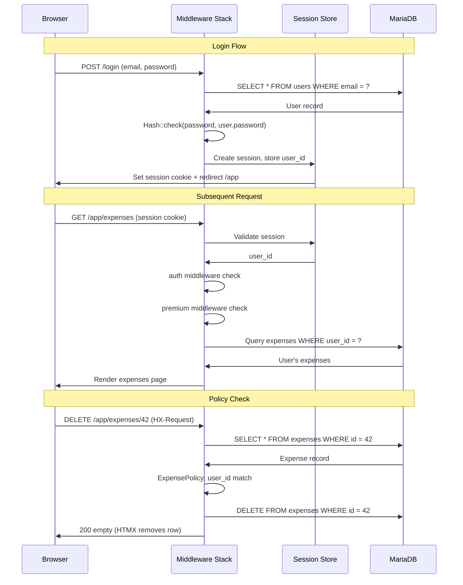

# Backend Architecture

## Controller Pattern

```php
class EggEntryController extends Controller
{
    use HandlesHtmx;

    public function index(Request $request)
    {
        $entries = $request->user()
            ->eggEntries()
            ->orderBy('date', 'desc')
            ->paginate(15);

        if ($this->isHtmx($request) && $request->has('page')) {
            return view('eggs.partials.table', compact('entries'));
        }

        return view('eggs.index', compact('entries'));
    }

    public function store(StoreEggEntryRequest $request)
    {
        $entry = $request->user()
            ->eggEntries()
            ->create($request->validated());

        if ($this->isHtmx($request)) {
            return view('eggs.partials.entry-row', compact('entry'));
        }

        return redirect()->route('app.eggs.index')
            ->with('success', 'Egg entry recorded.');
    }

    public function update(StoreEggEntryRequest $request, EggEntry $egg)
    {
        $this->authorize('update', $egg);
        $egg->update($request->validated());

        if ($this->isHtmx($request)) {
            return view('eggs.partials.entry-row', ['entry' => $egg]);
        }

        return redirect()->route('app.eggs.index')
            ->with('success', 'Entry updated.');
    }

    public function destroy(Request $request, EggEntry $egg)
    {
        $this->authorize('delete', $egg);
        $egg->delete();

        if ($this->isHtmx($request)) {
            return response('', 200);
        }

        return redirect()->route('app.eggs.index')
            ->with('success', 'Entry deleted.');
    }
}
```

## HandlesHtmx Trait

```php
trait HandlesHtmx
{
    protected function isHtmx(Request $request): bool
    {
        return $request->hasHeader('HX-Request');
    }

    protected function htmxRedirect(string $url): Response
    {
        return response('', 200)->header('HX-Redirect', $url);
    }

    protected function htmxTrigger(string $event, $body = ''): Response
    {
        return response($body, 200)->header('HX-Trigger', $event);
    }
}
```

## Model Pattern

```php
class EggEntry extends Model
{
    protected $fillable = ['date', 'count', 'size', 'color', 'notes'];

    protected $casts = [
        'date' => 'date',
        'count' => 'integer',
    ];

    public function user(): BelongsTo
    {
        return $this->belongsTo(User::class);
    }

    public function scopeForWeek(Builder $query, ?Carbon $date = null): Builder
    {
        $date ??= now();
        return $query->whereBetween('date', [
            $date->startOfWeek(), $date->endOfWeek(),
        ]);
    }

    public function scopeForMonth(Builder $query, ?Carbon $date = null): Builder
    {
        $date ??= now();
        return $query->whereMonth('date', $date->month)
                     ->whereYear('date', $date->year);
    }
}
```

## User Model

```php
class User extends Authenticatable
{
    use HasFactory, Notifiable;

    protected $fillable = ['name', 'email', 'password', 'tier', 'is_admin', 'yearly_egg_goal', 'egg_price', 'chicken_goal'];

    protected $casts = [
        'email_verified_at' => 'datetime',
        'password' => 'hashed',
        'is_admin' => 'boolean',
        'egg_price' => 'decimal:2',
        'chicken_goal' => ChickenGoal::class,
    ];

    public function isPremium(): bool
    {
        return $this->tier === 'premium' || $this->is_admin;
    }

    public function isFree(): bool
    {
        return $this->tier === 'free' && ! $this->is_admin;
    }

    public function eggEntries(): HasMany { return $this->hasMany(EggEntry::class); }
    public function expenses(): HasMany { return $this->hasMany(Expense::class); }
    public function feedInventory(): HasMany { return $this->hasMany(FeedInventory::class); }
    public function flockProfile(): HasOne { return $this->hasOne(FlockProfile::class); }
    public function flockBatches(): HasMany { return $this->hasMany(FlockBatch::class); }
    public function customers(): HasMany { return $this->hasMany(Customer::class); }
    public function sales(): HasMany { return $this->hasMany(Sale::class); }
}
```

## DashboardService

```php
class DashboardService
{
    public function getSummary(User $user): array
    {
        return [
            'eggs' => $this->getEggStats($user),
            'financial' => $this->getFinancialStats($user),
            'flock' => $this->getFlockStats($user),
            'recent_activity' => $this->getRecentActivity($user),
        ];
    }

    private function getEggStats(User $user): array
    {
        $entries = $user->eggEntries();
        return [
            'today' => (clone $entries)->whereDate('date', today())->sum('count'),
            'this_week' => (clone $entries)->forWeek()->sum('count'),
            'this_month' => (clone $entries)->forMonth()->sum('count'),
            'daily_average' => round((clone $entries)->forMonth()->avg('count') ?? 0, 1),
        ];
    }

    private function getFinancialStats(User $user): array
    {
        return [
            'total_revenue' => $user->sales()->sum('total_amount'),
            'month_revenue' => $user->sales()
                ->whereMonth('sale_date', now()->month)->sum('total_amount'),
            'total_expenses' => $user->expenses()->sum('amount'),
            'month_expenses' => $user->expenses()
                ->whereMonth('date', now()->month)->sum('amount'),
            'unpaid_sales' => $user->sales()->where('paid', false)->sum('total_amount'),
        ];
    }

    private function getFlockStats(User $user): array
    {
        $batches = $user->flockBatches()->where('is_active', true);
        return [
            'total_birds' => (clone $batches)->sum('current_count'),
            'active_batches' => (clone $batches)->count(),
            'total_hens' => (clone $batches)->sum('hens_count'),
            'total_mortality' => $user->flockBatches()
                ->withSum('deathRecords', 'count')
                ->get()->sum('death_records_sum_count') ?? 0,
        ];
    }

    private function getRecentActivity(User $user): Collection
    {
        $events = collect();

        $events = $events->merge(
            $user->eggEntries()->latest('date')->limit(3)->get()
                ->map(fn ($e) => ['date' => $e->date, 'type' => 'egg', 'description' => "{$e->count} eggs collected"])
        );

        $events = $events->merge(
            $user->sales()->latest('sale_date')->limit(3)->get()
                ->map(fn ($s) => ['date' => $s->sale_date, 'type' => 'sale', 'description' => "Sale: \${$s->total_amount}"])
        );

        $events = $events->merge(
            BatchEvent::where('user_id', $user->id)->latest('date')->limit(3)->get()
                ->map(fn ($e) => ['date' => $e->date, 'type' => 'batch_event', 'description' => $e->description])
        );

        return $events->sortByDesc('date')->take(10)->values();
    }
}
```

## Authentication Flow



## Premium Middleware

```php
class EnsurePremiumTier
{
    public function handle(Request $request, Closure $next): Response
    {
        if ($request->user()->isPremium()) {
            return $next($request);
        }

        if ($request->header('HX-Request')) {
            return response()->view('partials.premium-gate', [
                'feature' => $request->route()->getName(),
            ]);
        }

        return redirect()->route('app.dashboard')
            ->with('warning', 'Upgrade to Premium to access this feature.');
    }
}
```

---
