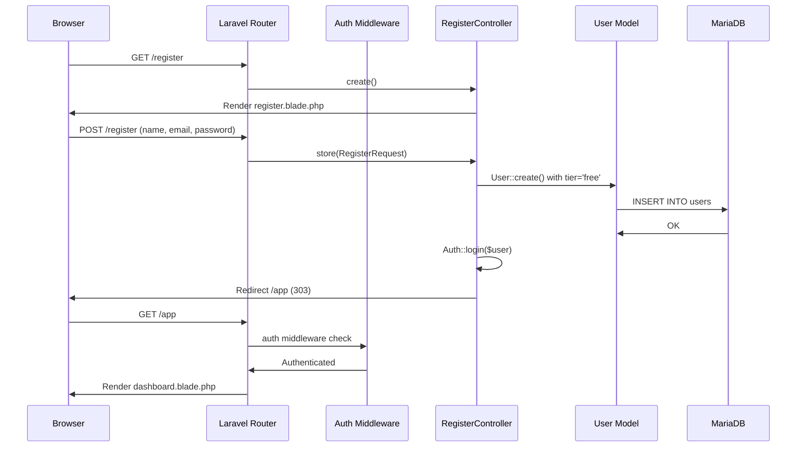
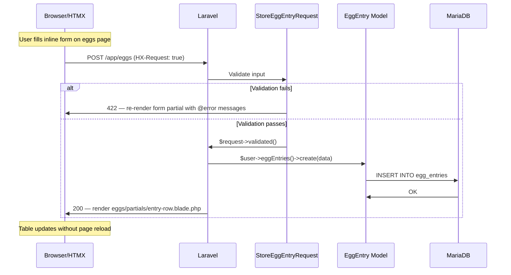
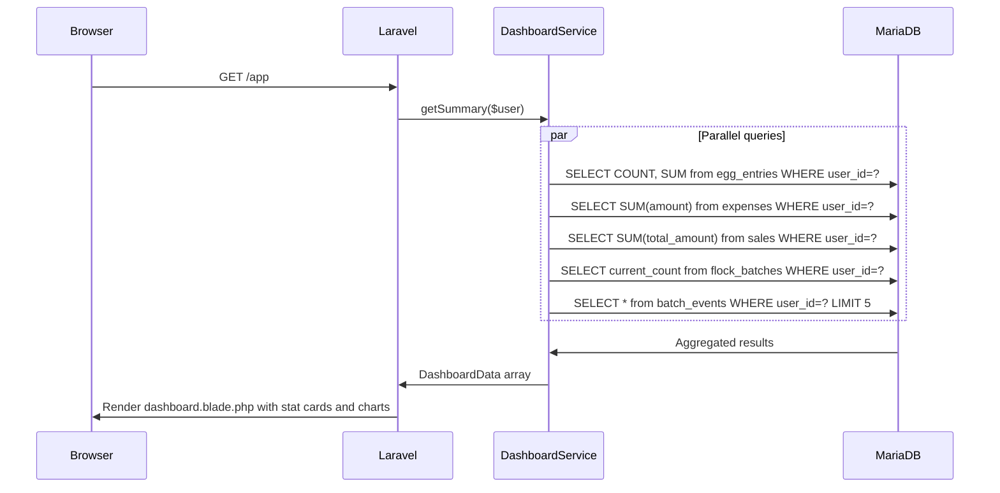
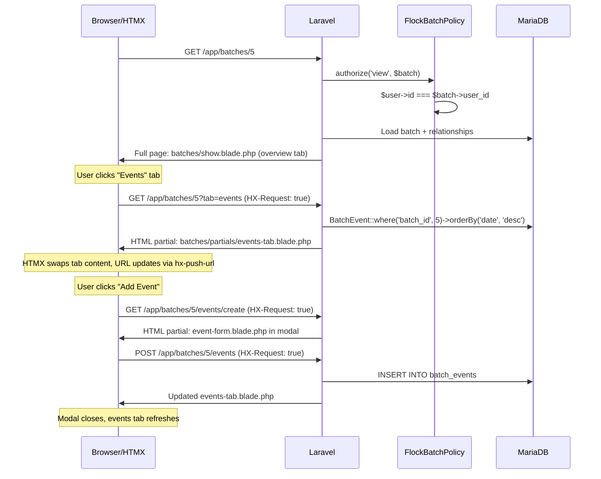
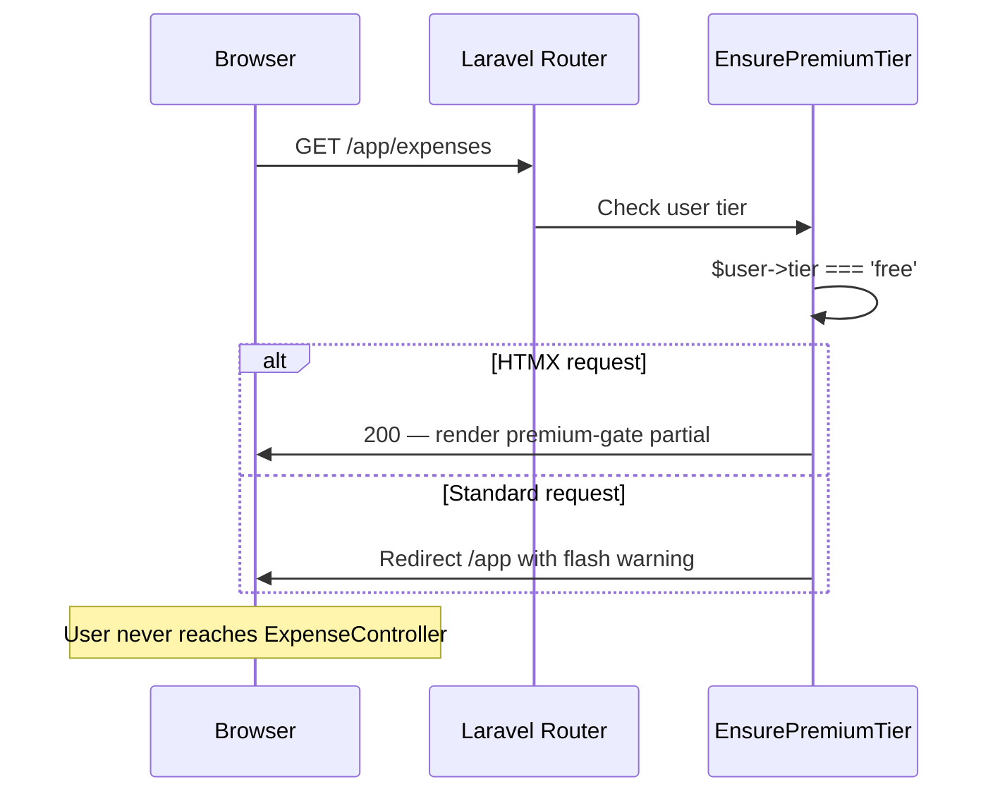
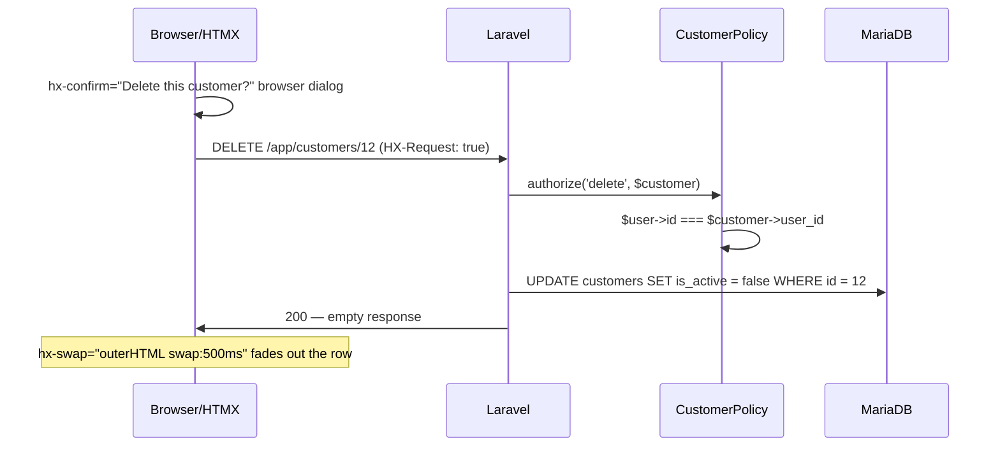

# Core Workflows

## Workflow 1: User Registration & First Login

## Workflow 2: Add Egg Entry (HTMX Inline Create)

## Workflow 3: Dashboard Load (Multi-Model Aggregation)

## Workflow 4: Batch Detail View with Tabs (HTMX Tab Switching)

## Workflow 5: Premium Feature Gate

## Workflow 6: Delete with Confirmation (HTMX)

---
