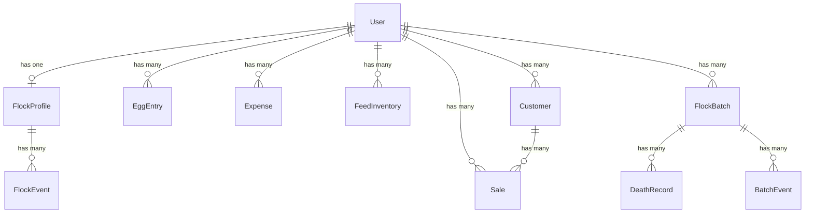

# Data Models

## User (extends Laravel Breeze)

**Purpose:** Authenticated user with tier support (free/premium)

**Key Attributes:**
- `id`: bigint (PK, auto-increment)
- `name`: string — display name
- `email`: string (unique) — login credential
- `password`: string — hashed
- `tier`: enum('free', 'premium') — feature gating
- `is_admin`: boolean — admin access flag
- `yearly_egg_goal`: integer (nullable) — annual egg production target
- `egg_price`: decimal(10,2) (nullable) — default price per egg for calculations
- `chicken_goal`: ChickenGoal enum (nullable) — user's primary chicken-keeping goal
- `email_verified_at`, `created_at`, `updated_at`: timestamps

**Relationships:**
- Has one `FlockProfile`
- Has many `EggEntry`, `Expense`, `FeedInventory`, `Customer`, `Sale`, `FlockBatch`

## FlockProfile

**Purpose:** Farm and flock configuration per user

**Key Attributes:**
- `id`: bigint (PK)
- `user_id`: FK → users (unique — one profile per user)
- `farm_name`: string (default: 'My Chicken Farm')
- `location`: string (nullable)
- `flock_size`: integer
- `breed`: string (nullable) — comma-separated breeds
- `start_date`: date (nullable)
- `hens`: integer (default: 0)
- `roosters`: integer (default: 0)
- `chicks`: integer (default: 0)
- `brooding`: integer (default: 0)
- `notes`: text (nullable)

**Relationships:**
- Belongs to `User`
- Has many `FlockEvent`

## EggEntry

**Purpose:** Daily egg production records

**Key Attributes:**
- `id`: bigint (PK)
- `user_id`: FK → users
- `date`: date
- `count`: integer (min: 0)
- `size`: enum('small', 'medium', 'large', 'extra-large', 'jumbo') — nullable
- `color`: enum('white', 'brown', 'blue', 'green', 'speckled', 'cream') — nullable
- `notes`: text (nullable)

**Relationships:**
- Belongs to `User`

## FlockEvent

**Purpose:** Timeline milestones in the flock's lifecycle

**Key Attributes:**
- `id`: bigint (PK)
- `flock_profile_id`: FK → flock_profiles
- `date`: date
- `type`: enum('acquisition', 'laying_start', 'broody', 'hatching', 'other')
- `description`: string
- `affected_birds`: integer (nullable)
- `notes`: text (nullable)

**Relationships:**
- Belongs to `FlockProfile`

## FeedInventory

**Purpose:** Feed purchases, inventory tracking, and depletion management

**Key Attributes:**
- `id`: bigint (PK)
- `user_id`: FK → users
- `brand`: string — feed brand name
- `feed_type`: FeedType enum — type of feed (layer, grower, starter, scratch, etc.)
- `quantity`: decimal(10,2) (min: 0)
- `unit`: enum('kg', 'lbs')
- `opened_date`: date (nullable) — when the bag was opened
- `depleted_date`: date (nullable) — when the bag was fully consumed
- `batch_number`: string (nullable) — manufacturer batch reference
- `total_cost`: decimal(10,2) (nullable)
- `expense_id`: FK → expenses (nullable) — linked expense record

**Relationships:**
- Belongs to `User`
- Belongs to `Expense` (nullable)

**Computed:**
- `isActive()`: bool — true when `depleted_date` is null
- `durationInDays()`: ?int — days between opened and depleted dates
- `markDepleted()`: sets `depleted_date` to today

## Expense

**Purpose:** Farm-related cost tracking

**Key Attributes:**
- `id`: bigint (PK)
- `user_id`: FK → users
- `date`: date
- `category`: string — (feed, medical, equipment, housing, utilities, other)
- `description`: string
- `amount`: decimal(10,2) (min: 0)

**Relationships:**
- Belongs to `User`

## Customer

**Purpose:** Egg buyer / customer records for CRM

**Key Attributes:**
- `id`: bigint (PK)
- `user_id`: FK → users
- `name`: string
- `phone`: string (nullable)
- `notes`: text (nullable)
- `is_active`: boolean (default: true) — soft filtering

**Relationships:**
- Belongs to `User`
- Has many `Sale`

## Sale

**Purpose:** Egg sale transactions

**Key Attributes:**
- `id`: bigint (PK)
- `user_id`: FK → users
- `customer_id`: FK → customers (nullable)
- `sale_date`: date
- `dozen_count`: integer (default: 0, min: 0)
- `individual_count`: integer (default: 0, min: 0)
- `total_amount`: decimal(10,2) (min: 0)
- `paid`: boolean (default: false)
- `notes`: text (nullable)

**Relationships:**
- Belongs to `User`
- Belongs to `Customer` (nullable)

## FlockBatch

**Purpose:** Individual batches of birds with lifecycle management

**Key Attributes:**
- `id`: bigint (PK)
- `user_id`: FK → users
- `batch_name`: string
- `breed`: string
- `acquisition_date`: date
- `initial_count`: integer (min: 1)
- `current_count`: integer (min: 0)
- `hens_count`: integer (default: 0)
- `roosters_count`: integer (default: 0)
- `chicks_count`: integer (default: 0)
- `brooding_count`: integer (default: 0)
- `type`: enum('hens', 'roosters', 'chicks', 'mixed')
- `age_at_acquisition`: enum('chick', 'juvenile', 'adult')
- `expected_laying_start_date`: date (nullable)
- `actual_laying_start_date`: date (nullable)
- `source`: string
- `cost`: decimal(10,2) (default: 0.00)
- `notes`: text (nullable)
- `is_active`: boolean (default: true)

**Relationships:**
- Belongs to `User`
- Has many `DeathRecord`
- Has many `BatchEvent`

## DeathRecord

**Purpose:** Mortality tracking per batch

**Key Attributes:**
- `id`: bigint (PK)
- `user_id`: FK → users
- `batch_id`: FK → flock_batches
- `date`: date
- `count`: integer (min: 1)
- `cause`: enum('predator', 'disease', 'age', 'injury', 'unknown', 'culled', 'other')
- `description`: string
- `notes`: text (nullable)

**Relationships:**
- Belongs to `User`
- Belongs to `FlockBatch`

## BatchEvent

**Purpose:** Lifecycle events per batch

**Key Attributes:**
- `id`: bigint (PK)
- `user_id`: FK → users
- `batch_id`: FK → flock_batches
- `date`: date
- `type`: enum('health_check', 'vaccination', 'relocation', 'breeding', 'laying_start', 'brooding_start', 'brooding_stop', 'production_note', 'flock_added', 'flock_loss', 'other')
- `description`: string
- `affected_count`: integer (nullable, min: 1)
- `notes`: text (nullable)

**Relationships:**
- Belongs to `User`
- Belongs to `FlockBatch`

## Entity Relationship Overview

---
